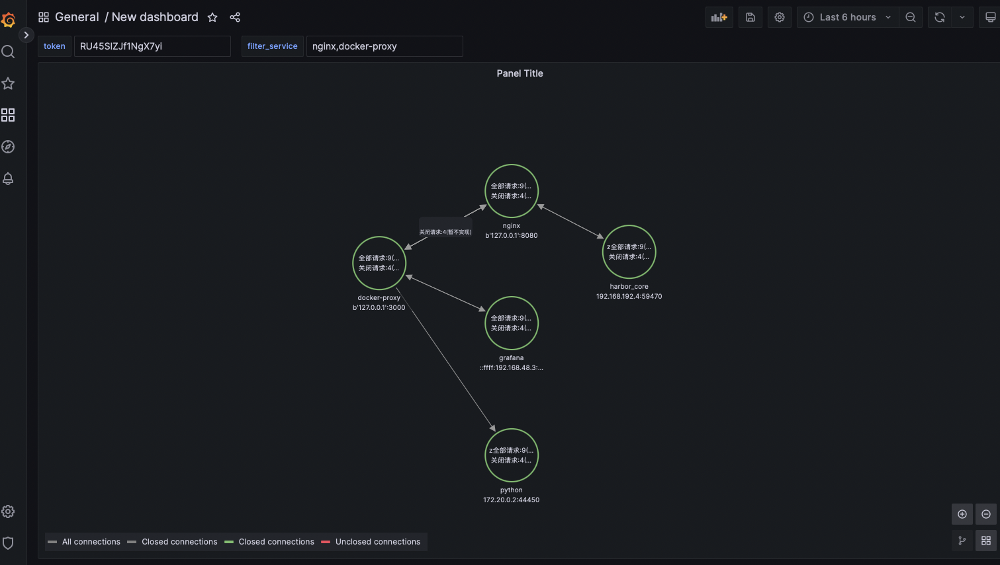
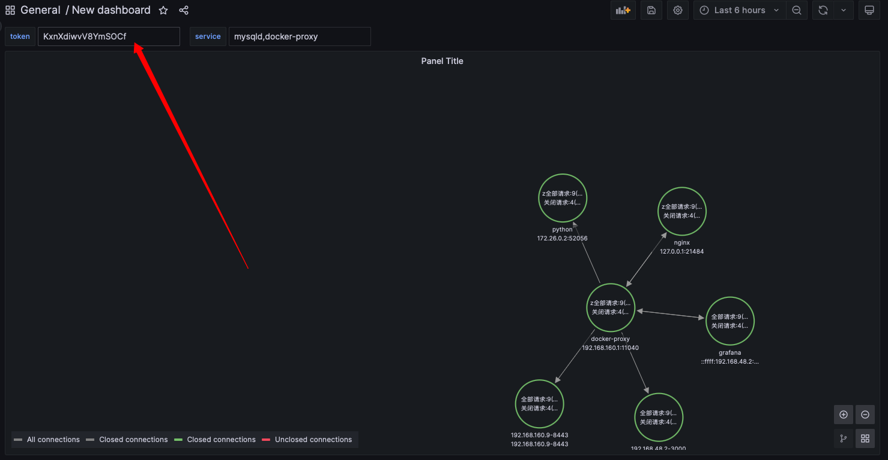

# link-bcc

## 效果演示



## 部署
1. 检查机器上是否安装了内核开发工具包 kernel-ml-devel-$(uname -r).rpm。 
```bash
   ls -anh /usr/src/kernels/|grep `uname -r`
   如果不存在可通过一下命令安装
   curl -o kernel-ml-devel-$(uname -r).rpm https://fr1.teddyvps.com/kernel/el7/kernel-ml-devel-$(uname -r).rpm && yum -y install kernel-ml-devel-$(uname -r).rpm
```

2. cd deploy && docker-compose up -d 


## 部署grafana进行展示

1. cd deploy/grafana && docker-compose up -d
2. 打开grafana http://127.0.0.1:3000
3. 默认账号密码: admin admin
4. 添加 data sources,数据类型选择 node graph api 填入：http://xx.xx.xx.xx:9108,部署link-bcc地址。
5. 导入仪表盘 ./deploy/grafana/node_grafa.json
6. 查看访问token,并填入面的token里面即可
```
    cd deploy && docker-compose logs |grep token
``` 

